# Juniper Salon: earlier-appointment waitlist

A working prototype for Lena at Juniper Salon. When a client cancels, staff enter the opening once. The app then offers it to the right waitlist client **one person at a time**, waits out each reply window, and moves on by itself until someone accepts. Staff can see who was contacted, who declined or timed out, who is holding the offer now, who is next, and how it ended.

Each opening is a durable [Temporal](https://temporal.io/) Workflow, so timers and offer state survive restarts, and two clients can never be holding the same opening.

## Run it (one command)

Requirements: Node.js 20 or newer and Docker Desktop (running).

```bash
npm install && npm run demo
```

- App: <http://localhost:3000>. The staff passcode is **`juniper`**.
- Temporal Web UI: <http://localhost:8233>

`npm run demo` runs reply windows **60× faster**, so a 15-minute hold takes 15 seconds. Use `npm run dev` for real-time holds.

Other commands:

```bash
npm test          # Workflow tests (time-skipping, no Docker needed)
npm run typecheck # Check TypeScript
npm run stop      # Stop the local Temporal service
```

> **Quiet hours:** No texts go out between 9:00 PM and 8:00 AM, so openings show **Paused** during that window. If you're evaluating at night, change the quiet hours under **Offer settings** on the front desk page (setting the same start and end time turns them off).

## Five-minute walkthrough

The waitlist starts with fictional sample clients chosen to show every path.

1. Sign in with `juniper`. You land on **Today's openings**.
2. Under **Add an opening**, choose **Haircut** with **Maya**, today, a time at least an hour from now. Click **Start offering**.
3. Open the opening's **Details**:
   - **Ana Ruiz** is offered first, because she joined earliest and matches service, time, and stylist. **Dev** (prefers Theo) and **Gus** (wants a Blowout) are never offered.
   - Open **Text sent** to see the exact message. Copy the link from it into another tab to see the client's page.
4. Let Ana's hold run out (15 s in demo mode). She's marked **Didn't reply in time**. **Chloe Park**'s number ends in `0000`, so her text fails three times and is marked **Text failed to send**. **Ben Ortiz** is offered next, with no staff action.
5. Open Ana's link again. It now says **This offer has expired**.
6. Open Ben's link and click **Yes, book it**. Ben sees a confirmation. The front desk shows a green **Ben Ortiz accepted an opening… Please add this to Square** banner, and Ben leaves the waitlist. Ana stays on it.
7. Add another opening to try **Skip**, **Assign someone…** (requires confirming you checked Square), and **Cancel this offer**. All three are inside **Details** and ask for confirmation.
8. Inspect any opening in the Temporal Web UI. The Workflow ID starts with `opening-`.

## Screenshots

All names and numbers are fictional sample data.

| Staff | |
|---|---|
| 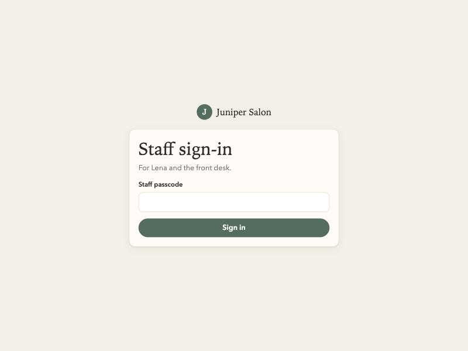 **Sign-in:** one shared staff passcode, then straight to today's openings. | 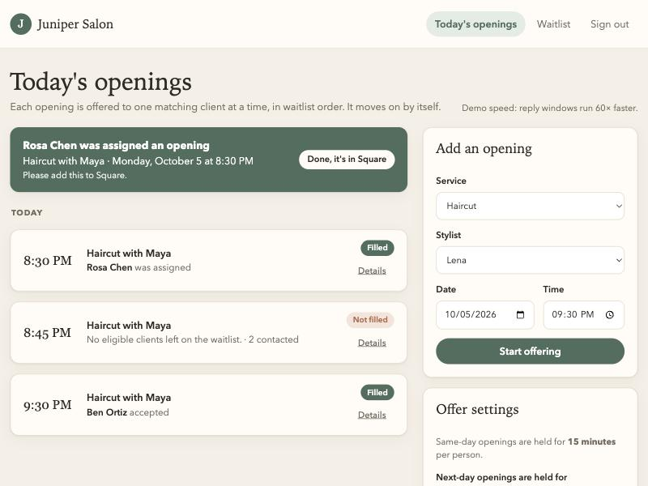 **Front desk:** a "please add this to Square" notice when an opening is filled, and each opening's status at a glance. |
| 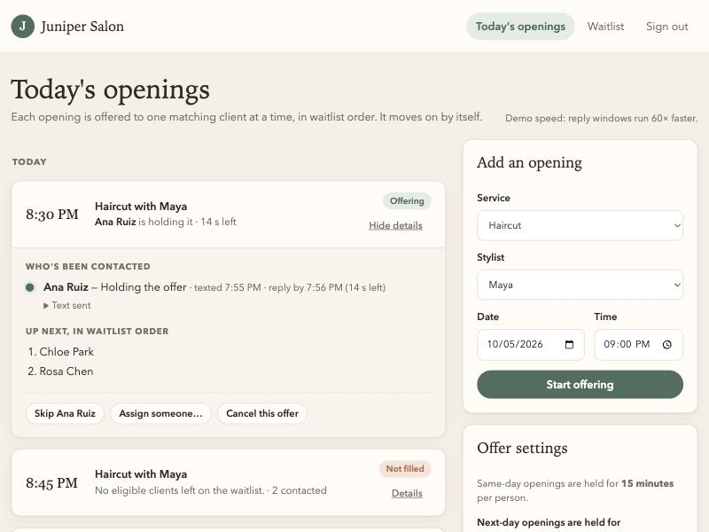 **Offer in progress:** who's holding it with a live countdown, who's next in waitlist order, and the staff actions. | 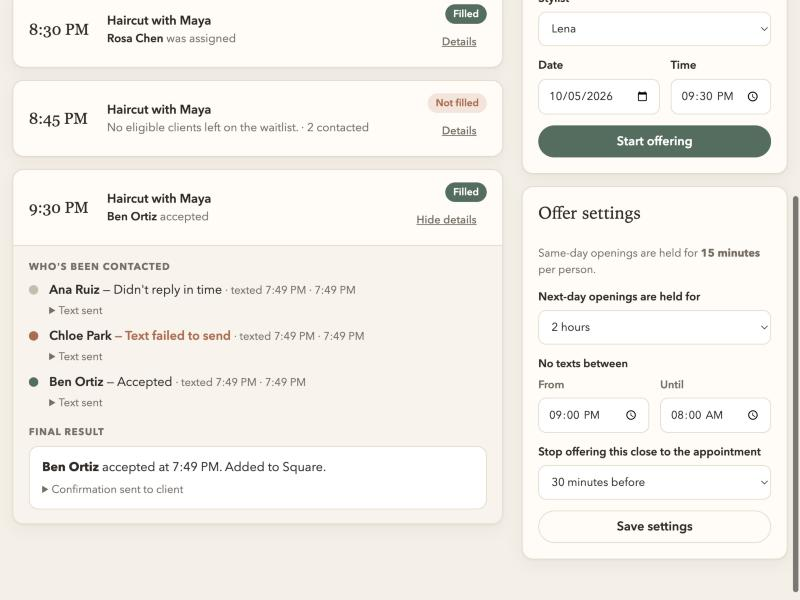 **History and settings:** timed out → text failed → accepted, the final result, and adjustable reply window, quiet hours, and cutoff. |
| 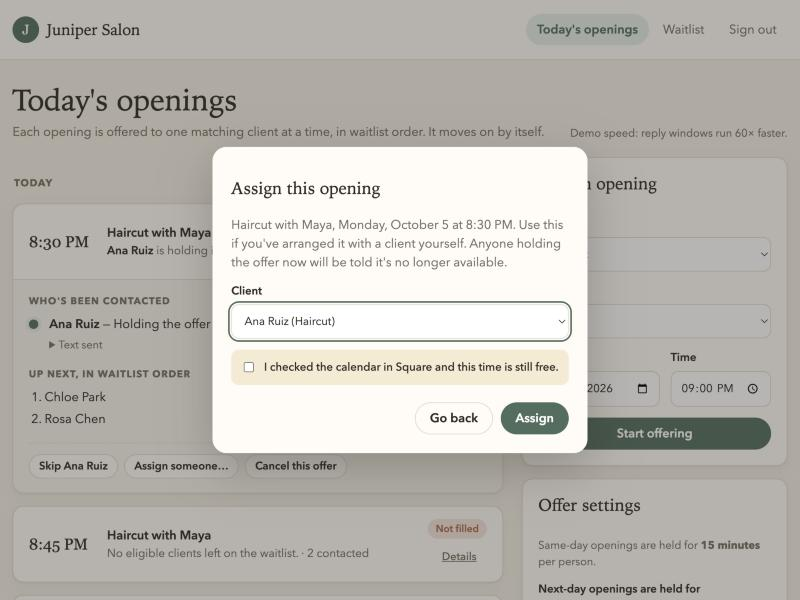 **Assign by hand:** requires confirming the Square calendar was checked. | 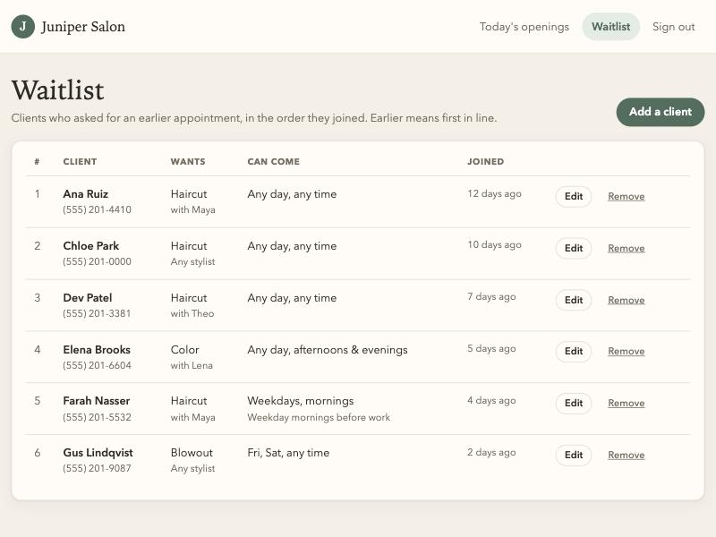 **Waitlist:** in the order clients joined, with edit and remove. |
| 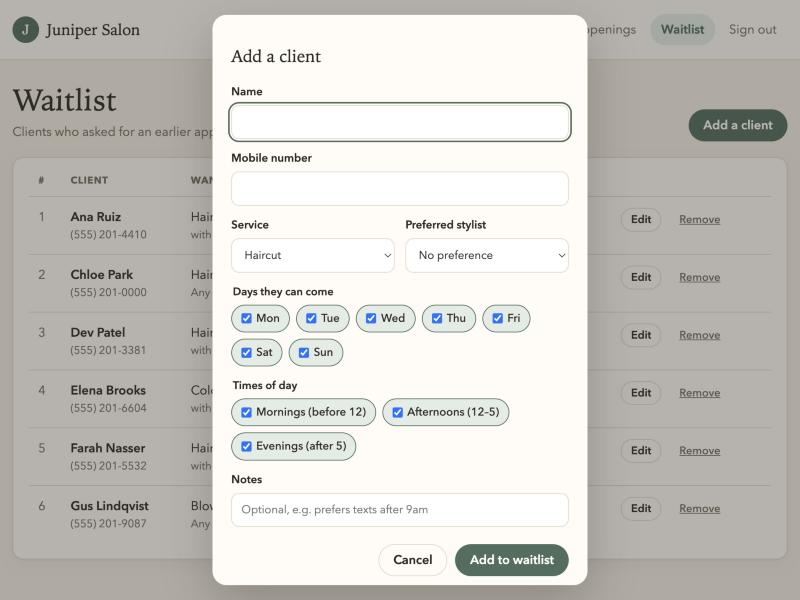 **Add a client:** service, stylist preference, days, and times of day. | 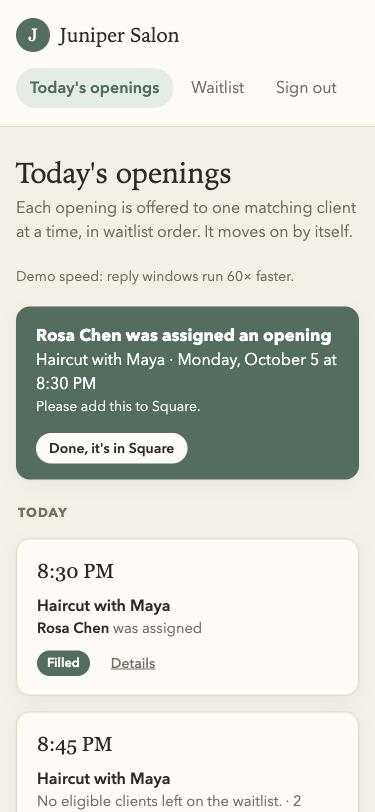 **On a phone:** the same front desk at phone width. |

| Client (private link from the text) | | |
|---|---|---|
| 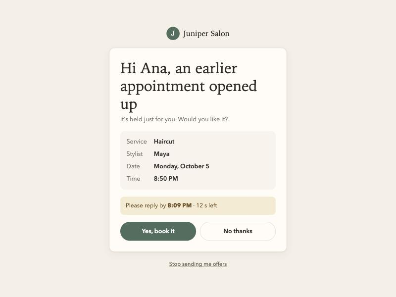 **Offer:** only their own appointment, with reply-by time. | 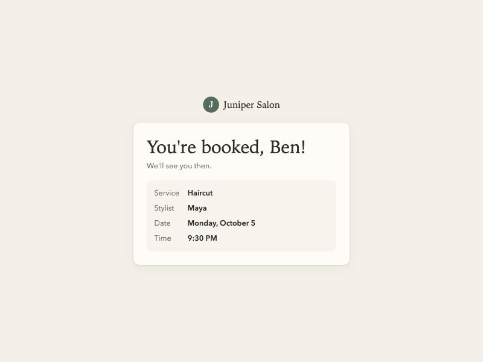 **Accepted:** a simple confirmation. | 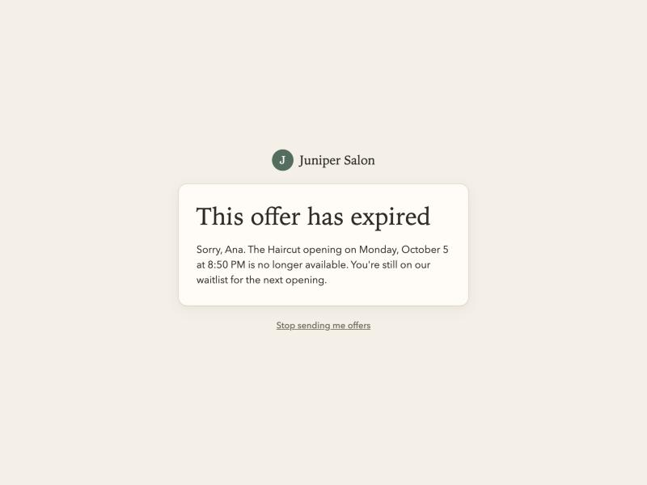 **Too late:** the offer has expired. |

## How Temporal is used

| Need from Lena | Temporal feature |
|---|---|
| Keep offering until it's filled, without anyone checking on it | One `openingWorkflow` per cancellation, running a durable loop |
| 15-minute same-day hold, adjustable next-day hold | Durable timers (`condition` with a timeout) |
| Never offer one opening to two people; never double-book a client | A single `salonWorkflow` owns the waitlist. Opening Workflows claim clients through Workflow **Updates**, which are processed one at a time. |
| Client replies, skip/cancel/assign | Workflow **Updates** with validation. A late "yes" returns *expired*. |
| Front-desk view of contacted / declined / timed out / remaining | Workflow **Queries** |
| Failed text marked failed, then move on | Activity retry policy (3 attempts), then the Workflow records **failed** |
| No late-night texts | Durable pause until quiet hours end |

## Repository map

- `src/workflows.ts`: `salonWorkflow` (waitlist, settings, holds) and `openingWorkflow` (the offer loop)
- `src/activities.ts`: talks to the salon Workflow, plus the simulated text provider
- `src/matching.ts`: matching, waitlist order, quiet hours, and message wording (pure functions)
- `src/api.ts`: staff sign-in, staff API, and the client offer-link API
- `src/seed.ts`: default settings and fictional sample clients
- `pages/`, `public/`: front desk, waitlist, client offer page, and sign-in
- `tests/workflow.test.ts`: Workflow tests covering order, timeouts, failed texts, late replies, double-booking, skip, assign, and cancel
- `docs/screenshots/`: every page of the prototype
- `docs/requirements.md`: Lena's requirements from the customer conversation, numbered and referenced in code
- `evidence/`: Temporal Web UI screenshot
- `slides/juniper-salon.pdf`: presentation for Lena

## Simulated or excluded

- **Text messages are simulated.** They are shown in each opening's details and printed in the Worker log. A number ending in `0000` simulates a delivery failure.
- **Square is not connected.** As today, staff update Square themselves. The app reminds them, and requires a calendar check before assigning manually.
- **Waitlist** replaces the Google Sheet, starting with fictional sample clients.
- **Staff sign-in** is one shared passcode (`STAFF_PASSCODE`), not real accounts.
- **Placeholder defaults Lena asked to adjust herself:** next-day hold 2 hours, quiet hours 9 PM–8 AM, stop offering 30 minutes before the appointment.
- **Times** use the computer's local time zone.
